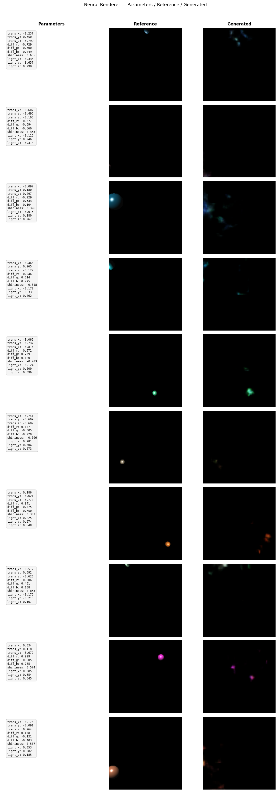
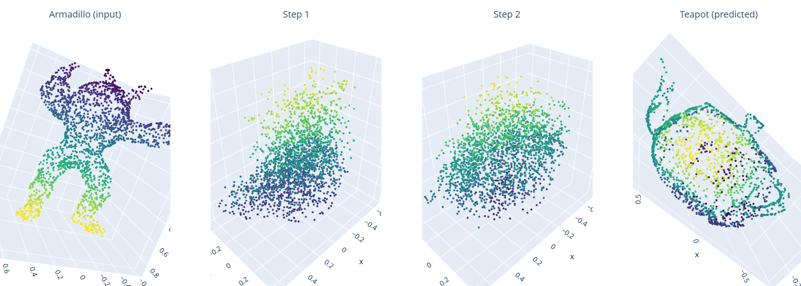

# SIGK - Artificial Intelligence in Computer Graphics

**Course:** Sztuczna Inteligencja w Grafice Komputerowej  
**Framework:** PyTorch | **Language:** Python

---

## Table of Contents

- [Project 1 - Super-Resolution & Denoising](#project-1--super-resolution--denoising)
- [Project 2 - HDR Exposure Synthesis](#project-2--hdr-exposure-synthesis)
- [Project 3 - Neural Rendering (Phong)](#project-3--neural-rendering-phong)
- [Project 4 - 3D Point Cloud Transformation](#project-4--3d-point-cloud-transformation)
- [Project 5 - TBD](#project-5--tbd)

---

## Project 1 - Super-Resolution & Denoising

> Full report: [`project1/SUMMARY.md`](project1-image-restoration/SUMMARY.md)

### Super-Resolution (SRUNet)
U-Net with residual blocks and PixelShuffle upsampling. Reconstructs HR images (256×256) from LR inputs at ×4 (64×64) and ×8 (32×32) scale.

| Method                | PSNR ↑ | SSIM ↑ | LPIPS ↓ |
|-----------------------|:------:|:------:|:-------:|
| Bicubic ×4            | 29.47  | 0.7554 | 0.3369  |
| **SRUNet ×4**         | **30.52** | **0.7906** | **0.3153** |
| Bicubic ×8            | 26.52  | 0.6301 | 0.4886  |
| **SRUNet ×8**         | **27.13** | **0.6565** | **0.4686** |

### Denoising (RIDNet)
Residual attention network with dilated convolutions and channel attention (EAM). Removes Gaussian noise at σ ∈ {0.01, 0.03}.

| Method             | PSNR ↑    | SSIM ↑    | LPIPS ↓   |
|--------------------|:---------:|:---------:|:---------:|
| Noisy input        | 33.65     | 0.8471    | 0.1509    |
| Bilateral filter   | 34.07     | 0.9058    | 0.1800    |
| **RIDNet**         | **40.80** | **0.9731**| **0.0938**|

---

## Project 2 - HDR Exposure Synthesis

> Full report: [`project2/SUMMARY.md`](project2-ldr-to-hdr/SUMMARY.md)

Neural network-based HDR imaging pipeline: a **ResUNet** generates two additional exposures (EV −2.7 and EV +2.7) from a single LDR input, which are then merged into an HDR image using the **Debevec algorithm** (OpenCV). Dataset: [HDR-Eye (EPFL)](https://www.epfl.ch/labs/mmspg/downloads/hdr-eye/) — 7 test scenes (C40–C46), ~28 training scenes, 1 400 training / 350 test patches (256×256 px).

### ResUNet Architecture
Encoder–decoder with residual blocks at every scale. Features: `[32, 64, 128, 256]`, ~11.9M parameters. Loss: `L = 0.8 · L1 + 0.2 · (1 − SSIM)`. Trained for 10 epochs (Adam, lr=1e-4) on Kaggle T4.

### Exposure Synthesis Results

| Direction    | PSNR ↑    | LPIPS ↓ |
|--------------|:---------:|:-------:|
| Underexposed | 19.66 dB  | 0.3729  |
| Overexposed  | 19.00 dB  | 0.5608  |


### HDR Reconstruction — Dynamic Range

Reconstructed HDR images reach ~5.8–7.6 EV dynamic range vs. 7.2–24.3 EV in the originals. The gap is inherent to the approach: only ±2.7 EV of bracketing (5.4 EV total) is available for Debevec merging.

| Scene | Original DR (EV) | Reconstructed DR (EV) |
|-------|:----------------:|:---------------------:|
| C40   | 20.27            | 6.22                  |
| C41   | 18.00            | 6.58                  |
| C42   | 8.18             | 6.94                  |
| C43   | 24.30            | 7.58                  |
| C44   | 7.17             | 5.78                  |
| C45   | 8.39             | 7.45                  |
| C46   | 14.07            | 6.99                  |


---

## Project 3 - Neural Rendering (Phong)

> Full report: [`project3/SUMMARY.md`](project3-rendering/SUMMARY.md)

Goal: approximate the **Phong lighting model** with a neural network. The model takes a scene parameter vector (object position, diffuse color, shininess, light position) and generates a 128×128 px rendering. Dataset: 3 000 procedurally rendered images; test set: indices 2400–2999 (600 samples).

Two architectures were evaluated: a **conditional DDPM diffusion model** and a **conditional GAN (LSGAN)**.

### Diffusion Model (DDPM / DDIM)

Conditional U-Net with sinusoidal time embedding and scene parameter conditioning. Trained for 67 epochs (early stopping, patience=10) on Kaggle T4.

| Method           | FLIP ↓ | LPIPS ↓ | SSIM ↑ | Hausdorff ↓ |
|------------------|:------:|:-------:|:------:|:-----------:|
| Diffusion (DDPM) | 0.0211 | 0.7940  | 0.0020 | 74.94 px    |

The model failed to reproduce object geometry or Phong shading — generated images resemble noisy pixel clusters rather than coherent renders.

### GAN (LSGAN + Masked L1)

Conditional GAN with spectral-normalized discriminator. Generator uses transposed convolutions to upsample from an 18-dim latent vector (noise z=8 + condition c=10) to 128×128 px. A **foreground mask** (brightness > 0.05) applies 50× weight to sphere pixels in the L1 loss, preventing the generator from collapsing to black backgrounds.

```
L_G = MSE(D(x_fake, c), 1.0) + 200.0 · L_masked_L1
```

Trained for 300 epochs (~58.7 min on T4), best checkpoint at epoch 240.

| Method | FLIP ↓     | LPIPS ↓    | SSIM ↑     | Hausdorff ↓  |
|--------|:----------:|:----------:|:----------:|:------------:|
| GAN    | **0.0125** | **0.1303** | **0.9650** | **19.63 px** |



The GAN successfully approximates the Phong model (SSIM=0.965, FLIP=0.0125), significantly outperforming the diffusion model across all metrics.

---

## Project 4 - 3D Point Cloud Transformation

> Full report: [`project4/SUMMARY.ipynb`](project4-3d-transformation/SUMMARY.ipynb)

Goal: train neural networks to deform a 3D point cloud from a source shape into a target shape (**teapot**). Three separate models were trained — **Armadillo**, **Bunny**, and **Dragon** as source objects. Generalisation is evaluated on an unseen shape — **Asian Dragon**.

### Architecture — VectorFieldNet

All models predict a **displacement field**: for each input point `x_i`, the network outputs `Δx_i`, and the final position is `x_pred = x_input + Δx`. This formulation makes the network learn only the shape *difference*, stabilising training. Each model follows a three-block pipeline:

| Block | Operation | Output shape |
|-------|-----------|-------------|
| Local encoder | Per-point shared MLP | `(B, N, 128)` |
| Global descriptor | Max-pool over points → MLP | `(B, 512)` broadcast to each point |
| Decoder | MLP on concat (local + global) → 3 | `(B, N, 3)` displacements |

Armadillo model (`VectorFieldNet`): **373 251** parameters. Input/output: `(B, 2048, 3)`.

### Loss — Chamfer Distance

CD(P, Q) = (1/|P|) * Σ_{p∈P} min_{q∈Q} ||p-q||²
         + (1/|Q|) * Σ_{q∈Q} min_{p∈P} ||q-p||²
         
The symmetric formulation penalises both predicted points far from the target and target regions not covered by the prediction.

### Training

All models: Adam, CosineAnnealingLR, batch size 16, 2048 points per cloud.

| Model     | Epochs    | LR              | Notes |
|-----------|:---------:|:---------------:|-------|
| Bunny     | 200       | 3e-4            | Single stage |
| Dragon    | 200       | 3e-4            | Single stage |
| Armadillo | 100 + 200 | 1e-3 → 3e-4     | Two-stage fine-tuning; val loss: 0.003517 → 0.001164 (~9% improvement) |

### Transition: Armadillo → Teapot



### Results

| Flow                              | IoU ↑  | Dice ↑ | Chamfer ↓ |
|-----------------------------------|:------:|:------:|:---------:|
| bunny → teapot                    | 0.7489 | 0.8565 | 3.1016    |
| dragon → teapot                   | 0.7581 | 0.8624 | 3.2829    |
| armadillo → teapot                | 0.7343 | 0.8468 | 3.2182    |
| asian dragon (bunny flow)         | 0.7203 | 0.8374 | 3.1777    |
| asian dragon (dragon flow)        | 0.7527 | 0.8589 | 3.1765    |
| **asian dragon (armadillo flow)** | **0.7974** | **0.8873** | **3.2282** |

All models achieve high IoU (>0.73) and Dice (>0.84). Notably, the armadillo model **generalises best** to the unseen Asian Dragon — the two-stage fine-tuning yielded a smoother displacement field that transfers well to new shapes.

---

## Project 5 - TBD

> *Coming soon.*
