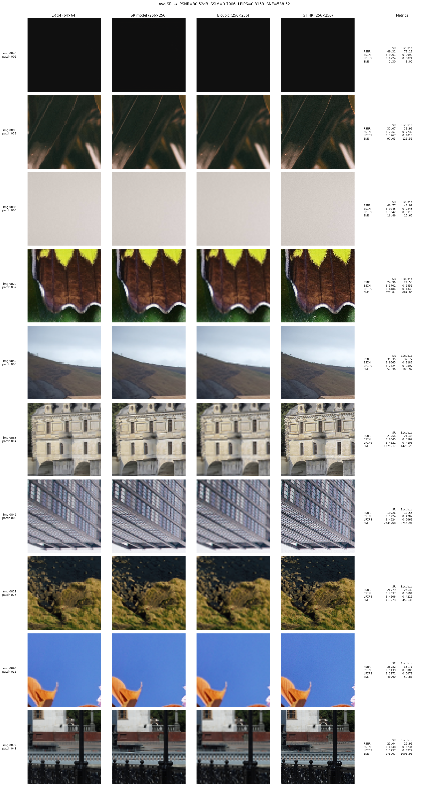
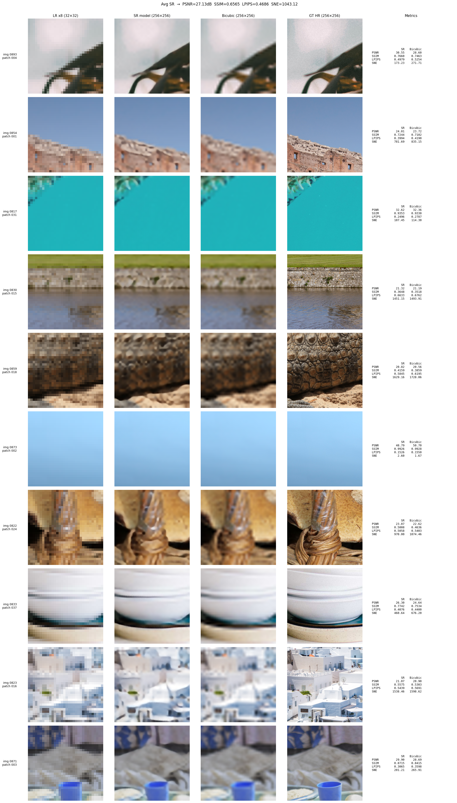

# SIGK - Projekt 1: Modyfikacja obrazów

## Opis projektu

Celem projektu było zaprojektowanie i wytrenowanie sieci neuronowej do realizacji wybranych zadań modyfikacji obrazów, a następnie porównanie jej jakości z metodami bazowymi przy użyciu metryk SNE, PSNR, SSIM oraz LPIPS.

Jako zbiór danych wykorzystano DIV2K - wysokiej jakości zbiór 900 obrazów w rozdzielczości HD i powyżej, powszechnie stosowany w tego typu zagadnieniach.

W ramach projektu zdecydowaliśmy się zrealizować dwa zadania:

1. Zwiększanie rozdzielczości (Super-Resolution) - rekonstrukcja obrazów HR (256×256) z obrazów LR o rozdzielczościach 64×64 (skala x4) oraz 32×32 (skala x8).

2. Odszumianie (Denoising) - usuwanie szumu gaussowskiego (o współczynnikach σ = 0.01 oraz σ = 0.03) z obrazów.

---

## 1. Zwiększanie rozdzielczości (Super-Resolution)
Autor: Filip Langiewicz
### 1.1 Przygotowanie danych

Obserwacje ze zbioru treningowego DIV2K pocięto na patche 256×256 (z każdego obrazka w zbiorze treningowym uzyskano 40 losowych patchy), a następnie przeskalowano w dół przy użyciu `cv2.resize` z interpolacją `cv2.INTER_AREA`, uzyskując wersje LR o rozdzielczościach **64×64** (skala x4) oraz **32×32** (skala x8). Dodatkowo przeprowadzono augmentację uzyskanych patchy poprzez losowe odwracanie wycinków w pionie (z prawdopodobieństwem 1/2) oraz w poziomie (z prawdopodobieństwem 1/2).

Patche w zbiorze walidacyjnym uzyskano poprzez pocięcie obrazów ze zbioru walidacyjnego DIV2K na nienachodzące na siebie fragmenty o rozmiarze 256×256.

| Zbiór     | Liczba próbek |
|-----------|:-------------:|
| Treningowy   | 32 000        |
| Walidacyjny | 3 598         |

---

### 1.2 Architektura - SRUNet

Zaproponowano architekturę **SRUNet** - sieć w stylu U-Net z blokami resztkowymi (`ResBlock`) i upsamplingiem przez `PixelShuffle`. Każdy blok enkodera zmniejsza rozdzielczość przez konwolucję ze `stride=2`, a dekoder odbudowuje przestrzenną rozdzielczość przez `PixelShuffle`. Końcowe głowice SR (`sr_up`) podnoszą rozdzielczość do docelowej. Do wyjścia dodawany jest residual skip z wejścia LR interpolowanego bikubicznie.

| Wariant | `base_ch` | `n_bottleneck` | Parametry   | Wejście LR | Wyjście HR |
|---------|:---------:|:--------------:|:-----------:|:----------:|:----------:|
| SR ×4   | 32        | 4              | 2 289 923   | 64×64      | 256×256    |
| SR ×8   | 32        | 4              | 2 326 915   | 32×32      | 256×256    |

---

### 1.3 Trening

| Parametr       | SR ×4                   | SR ×8                   |
|----------------|:-----------------------:|:-----------------------:|
| Epoki          | 150                     | 200                     |
| Batch size     | 32                      | 32                      |
| Optymalizator  | Adam                    | Adam                    |
| LR startowe    | 1e-4                    | 1e-4                    |
| Scheduler      | StepLR (step=30, γ=0.5) | StepLR (step=30, γ=0.5) |
| Funkcja straty | L1                      | L1                      |
| Walidacja co   | 10 epok                 | 10 epok                 |
| Checkpoint     | best PSNR on valid      | best PSNR on valid      |

Sieć dla skali ×4 trenowała się poprawnie do około 100 epoki. Wówczas uzyskano najlepszy wynik metryki PSNR dla zbioru walidacyjnego. W następnych epokach widoczny jest efekt przeuczenia sieci - maleje błąd na zbiorze treningowym, natomiast powiększa się błąd dla zbioru walidacyjnego. W związku z tym postanowiono jako najlepsze rozwiązanie wybrać sieć z wagami z 100 epoki.

Analogiczna sytuacja miała miejsca w przypadku skali ×8. Sieć zaczęła się przeuczać już w około 30 epoce, w związku z tym wykorzystano wagi z tego momentu treningu.

---

### 1.4 Wyniki - skala ×4

| Metoda                     | PSNR (dB) ↑ | SSIM ↑     | LPIPS ↓    | SNE ↓      |
|----------------------------|:-----------:|:----------:|:----------:|:----------:|
| cv2_resize_bicubic_x4     | 29.47       | 0.7554     | 0.3369     | 642.70     |
| **SRUNet_x4** (nasz model) | **30.52**   | **0.7906** | **0.3153** | **538.52** |

### 1.5 Wyniki - skala ×8

| Metoda                     | PSNR (dB) ↑ | SSIM ↑     | LPIPS ↓    | SNE ↓        |
|----------------------------|:-----------:|:----------:|:----------:|:------------:|
| cv2_resize_bicubic_x8     | 26.52       | 0.6301     | 0.4886     | 1159.15      |
| **SRUNet_x8** (nasz model) | **27.13**   | **0.6565** | **0.4686** | **1043.12**  |

> Metryki obliczone na pełnym zbiorze walidacyjnym DIV2K (3598 patchy 256×256).  
> Wartości `inf` na potrzeby obliczenia metryki PSNR zastąpiono wartością 42 przed uśrednieniem.

---

### 1.6 Porównanie wizualne - SR ×4

*Od lewej: LR wejście (64×64), wyjście SRUNet (256×256), Bicubic (256×256), GT HR (256×256)*

Jak widać na obrazkach różnica jest dostrzegalna gołym okiem. Sieć nauczyła się niektórych kształtów i konturów, co daje lepsze obrazki wyjściowe niż zwykła interpolacja. Zdjęcia z rozdzielczością czterokrotnie zwiększoną przez sieć są dużo mniej romzyte i zawierają więcej ostrych krawędzi.

---

### 1.7 Porównanie wizualne - SR ×8

*Od lewej: LR wejście (32×32), wyjście SRUNet (256×256), Bicubic (256×256), GT HR (256×256)*

W tym przypadku sieć również poprawiła rozdzielczość zdjęć lepiej niż bazowa metoda z biblioteki cv2. Efekty są jednak mniej widoczne niż przy czterokrotnym zwiększaniu rozdzielczości. Mimo tego, dalej dostrzegalna jest różnica pomiędzy interpolacją a naszą siecią.

---

### 1.8 Wnioski

- SRUNet poprawia wszystkie cztery metryki względem bazowej interpolacji bikubicznej dla obu skal.
- Dla ×4 poprawa PSNR wynosi **+1.05 dB**, SSIM **+0.0352**, LPIPS **-0.0216** - model lepiej rekonstruuje drobne tekstury i krawędzie.
- Dla ×8 poprawa jest mniejsza (**+0.61 dB** PSNR), co jest spodziewane - 8-krotna utrata rozdzielczości niesie ze sobą znacznie mniej informacji wejściowych.
- Połączenia resztkowe z interpolacją bikubiczną stabilizują trening od pierwszych epok i zapewniają sensowne wyjście bazowe nawet bez uczenia.
- Wartości metryki LPIPS sugerują, że model percepcyjnie rekonstruuje globalną strukturę obrazu, choć drobne detale pozostają trudne do odtworzenia.

---

## 2. Odszumianie (Denoising)
Autor: Dominika Boguszewska

### 2.1 Przygotowanie danych

Każdą obserwację ze zbioru treningowego DIV2K wczytano, a następnie poddano normalizacji do zakresu [0,1], co zapewnia stabilność procesu uczenia i ułatwia optymalizację modelu.

Z każdej próbki wygenerowano 40 losowych patchy o rozmiarze 256 × 256. Takie podejście zwiększa różnorodność danych treningowych oraz pozwala modelowi lepiej uogólniać wzorce lokalne. Każdy patch podlegał augmentacji danych: z prawdopodobieństwem 50% był losowo odbijany w pionie oraz z prawdopodobieństwem 50% był losowo odbijany w poziomie, co dodatkowo zwiększało wariancję zbioru bez potrzeby pozyskiwania nowych danych.

Do tak przygotowanych patchy dodawano szum gaussowski o losowo wybranym odchyleniu standardowym `σ ∈ {0.01, 0.03}`, symulując różne poziomy degradacji obrazu. Następnie zaszumione obrazy poddawano procesowi odszumiania z wykorzystaniem filtru bilateralnego (`bilateral_denoise`), który skutecznie redukuje szum przy jednoczesnym zachowaniu krawędzi i istotnych struktur obrazu.

Dla każdego patcha zapisano trzy jego wersje:
* oryginalną (ground truth),
* zaszumioną,
* odszumioną za pomocą filtru bilateralnego.

Zbiór walidacyjny przygotowano analogicznie, zapewniając spójność procesu ewaluacji z warunkami treningowymi.

W wyniku powyższego procesu uzyskano następującą liczebność danych:

| Zbiór     | Liczba próbek |
|-----------|:-------------:|
| Treningowy   |    32000     |
| Walidacyjny |     4000      |

Ze względu na ograniczenia zasobów obliczeniowych podczas właściwego treningu wykorzystano jedynie 10 patchy na każdą obserwację. Dodatkowo zbiór treningowy podzielono na podzbiory treningowy i walidacyjny w proporcji 80/20. Kluczowym aspektem było zapewnienie, że wszystkie patche pochodzące z jednej obserwacji trafiają wyłącznie do jednego podzbioru, co eliminuje ryzyko data leakage i zapewnia wiarygodność wyników.

Ostatecznie w procesie treningu i ewaluacji wykorzystano:

| Zbiór     | Liczba próbek |
|-----------|:-------------:|
| Treningowy   |     6400      |
| Walidacyjny |     1600      |
| Treningowy   |     1000      |

---

### 2.2 Architektura - RIDNet

Model RIDNet (Residual Image Denoising Network) został zaprojektowany do usuwania szumu z obrazów poprzez efektywne łączenie mechanizmów residual learning oraz attention. Architektura składa się z trzech głównych komponentów: ekstrakcji cech, głębokiego przetwarzania (EAM) oraz rekonstrukcji obrazu.

Pierwszym etapem przetwarzania jest moduł ekstrakcji cech składający się z pojedynczej warstwy konwolucyjnej. Celem tej warstwy jest przekształcenie obrazu wejściowego do przestrzeni cech o większej liczbie kanałów, co umożliwia dalsze, bardziej złożone operacje. Jest to stosunkowo płytki etap, którego zadaniem jest jedynie wstępna reprezentacja danych.

Główna część modelu to sekwencja bloków EAM (Enhancement Attention Module). W naszym modelu RIDNet zastosowano 3 takie bloki. Każdy z nich składa się z kilku podkomponentów:

1. **Ekstrakcja cech wieloskalowych (dilated convolutions)** - wykorzystuje konwolucje z dylatacją, aby „widzieć” większy obszar obrazu bez zwiększania liczby parametrów. Dzięki temu model jednocześnie uchwytuje drobne detale (lokalne informacje) oraz szerszy kontekst (globalne informacje).
2. **Blok residualny (Residual Block)** - uczy się modyfikować wejściowe cechy zamiast tworzyć je od zera. Dzięki połączeniu skip connection: łatwiejszy przepływ gradientu, stabilniejszy trening, lepsze zachowanie informacji wejściowej.
3. **Ulepszony blok residualny (Enhanced Residual Block)** - rozszerzona wersja bloku residualnego z dodatkowymi warstwami. Pozwala: modelować bardziej złożone zależności, lepiej łączyć i przekształcać cechy, zwiększyć zdolność reprezentacyjną sieci.
4. **Mechanizm uwagi kanałowej (Channel Attention)** - nadaje wagę poszczególnym kanałom cech: wzmacnia istotne informacje (np. krawędzie) oraz tłumi mniej ważne (np. szum). Dzięki temu model „skupia się” na tym, co najważniejsze dla odszumiania.

Ostatni etap to moduł rekonstrukcji (Reconstruction Module) składający się z pojedynczej warstwy konwolucyjnej. Jej zadaniem jest przekształcenie przetworzonych cech z powrotem do przestrzeni obrazu.

---

### 2.3 Trening

| Parametr       |         RIDNet         |
|----------------|:----------------------:|
| Epoki          |           15           |
| Batch size     |           4            |
| Optymalizator  |          Adam          |
| LR startowe    |          1e-3          |
| Scheduler      | StepLR (step=5, γ=0.5) |
| Funkcja straty |        MSE Loss        |
| Walidacja co   |        1 epokę         |
| Checkpoint     |   min loss on valid    |
| Early stopping |           3            |

Trening sieci ustawiono na 15 epok, jednakże najmniejszą wartość funkcji straty na zbiorze walidacyjnym oraz najlepszy wynik metryki PSNR dla zbioru walidacyjnego uzyskano po 13 epoce.

---

### 2.4 Wyniki

| Metoda                       | PSNR (dB) ↑ |   SSIM ↑   |  LPIPS ↓  |    SNE ↓    |
|------------------------------|:-----------:|:----------:|:---------:|:-----------:|
| Pary czysty-zaszumiony obraz |   33.6958   |   0.8504   |  0.1455   |  376.0818   |
| denoise_bilateral (skimage)  |   33.8053   |   0.9062   |  0.1773   |  382.9705   |
| RIDNet (nasz model)          | **40.5845** | **0.9733** | **0.089** | **78.5469** |

> Metryki obliczone na zbiorze testowym składającym się z 10 patchy na próbkę ze zbioru walidacyjnego DIV2K (1000 patchy 256×256).  
> Wartości `inf` na potrzeby obliczenia metryki PSNR zastąpiono wartością 42 przed uśrednieniem.

---

### 2.5 Porównanie wizualne

*Od lewej: Czysty obraz, Zaszumiony obraz, Wyjście RIDNet, Wyjście denoise_bilateral*

Przede wszystkim widać, że RIDNet skuteczniej usuwa szum, szczególnie przy wyższych poziomach zakłóceń (`σ = 0.03`). Obrazy po przejściu przez model są wyraźnie gładsze, a jednocześnie zachowują istotne struktury, takie jak krawędzie czy tekstury.

Z kolei filtr bilateralny, choć również usuwa szum, działa bardziej lokalnie i opiera się na prostych zależnościach między pikselami. W efekcie: dobrze wygładza jednolite obszary, częściowo zachowuje krawędzie, ale często prowadzi do utraty drobnych detali i tekstur, wyniku czego obrazy są rozmyte.

---

### 2.6 Wnioski

- RIDNet znacząco przewyższa metodę `bilateral_denoise` pod względem jakości rekonstrukcji. Wartość PSNR równa 40.58 dB wskazuje na bardzo dobrą zgodność z obrazem referencyjnym, co oznacza skuteczne usunięcie szumu przy minimalnej utracie informacji.
- RIDNet osiąga również najlepsze wyniki w metrykach percepcyjnych. Wysokie SSIM (0.9733) potwierdza, że struktura obrazu jest bardzo dobrze zachowana, natomiast najniższa wartość LPIPS (0.089) wskazuje na największe podobieństwo wizualne do obrazu oryginalnego.
- Filtr bilateralny poprawia strukturę obrazu, ale kosztem jakości percepcyjnej. W porównaniu do obrazu zaszumionego, metoda ta zwiększa SSIM, jednak pogarsza LPIPS i SNE, co sugeruje nadmierne wygładzanie i utratę detali.
- RIDNet oferuje lepszy kompromis między redukcją szumu a zachowaniem detali, zaś filtr bilateralny jest prostszy i szybszy, ale mniej precyzyjny i bardziej podatny na utratę szczegółów.

---
