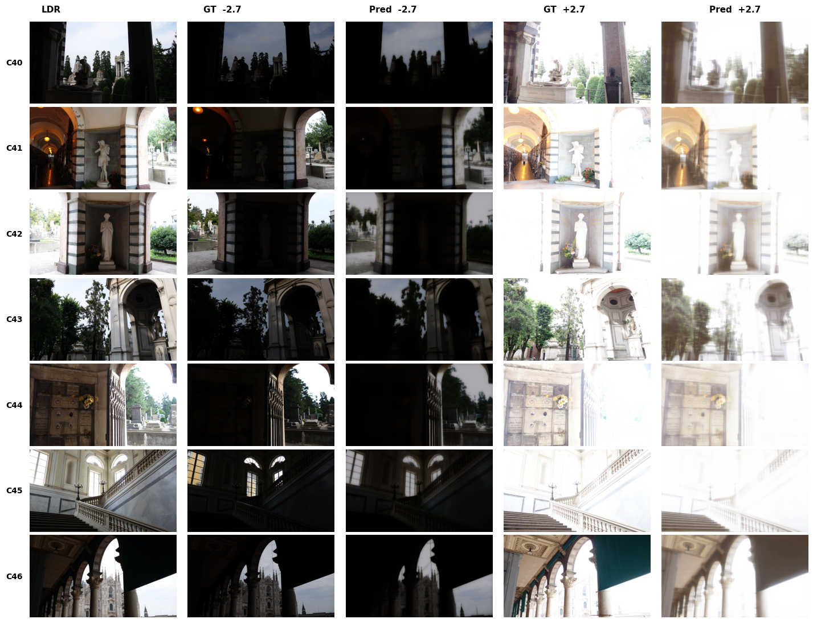

# SIGK - Projekt 2: Syntezator ekspozycji

## Opis projektu

Celem projektu było stworzenie sieci neuronowej, która na podstawie pojedynczego obrazu
o standardowej ekspozycji (LDR) generuje dwa dodatkowe obrazy: niedoświetlony
(EV = −2.7) oraz prześwietlony (EV = +2.7). Wygenerowane obrazy wraz z oryginalnym
LDR służą następnie do rekonstrukcji obrazu HDR algorytmem Debeveca (OpenCV).

---

## Sieci neuronowe
Autor: Filip Langiewicz

---

### Dane - HDR-Eye (EPFL)

Jako zbiór danych wykorzystano **HDR-Eye**:
<https://www.epfl.ch/labs/mmspg/downloads/hdr-eye/>

Interesujące foldery z datasetu:

| Folder | Zawartość | Rola |
|---|---|---|
| `Bracketed_images/` | Zdjęcia o różnych czasach naświetlenia | Źródło targetów EV ±2.7 |
| `LDR/` | Obrazy o standardowej ekspozycji (EV = 0.0) | Wejście sieci |
| `HDR/` | Referencyjne pliki HDR | Punkt odniesienia po rekonstrukcji |

Podział na zbiory:
- **Testowy**: sceny C40–C46 (7 scen) - stały, określony przez treść zadania
- **Treningowy**: wszystkie pozostałe sceny

---

### Analiza danych (EDA)

Skrypt `eda.py` wykonał skanowanie całego datasetu i wygenerował raport obejmujący:

- liczbę plików na scenę (oczekiwane: 9 zdjęć)
- dostępne wartości EV (odczyt pola `ExposureBiasValue` z metadanych EXIF)
- obecność pliku LDR dla każdej sceny
- przynależność do zbioru treningowego lub testowego

Dla scen z brakującymi metadanymi EV przeprowadzono dodatkową analizę:
wartości EV zostały wyestymowane na podstawie pola `ExposureTime` - obliczono
kroki między kolejnymi zdjęciami jako `ΔEV = log2(ET[i+1] / ET[i])`
i zweryfikowano ich spójność (tolerancja 0.15 EV). Niestety analiza ta nie przyniosła pozytywnych rezultatów z powodu braku niezbędnych metadanych w poszczególnych zdjęciach.

---

### Przygotowanie danych

Skrypt `prepare_data.py` przeskanował folder `Bracketed_images/` i dla każdej sceny:

1. Odczytał `ExposureBiasValue` z EXIF każdego zdjęcia
2. Wybrał obraz z EV = −2.7 (tolerancja ±0.05) jako target *under*
3. Wybrał obraz z EV = +2.7 (tolerancja ±0.05) jako target *over*
4. Skopiował odpowiadający plik LDR

Wynikowa struktura danych (`nn_data/selected/`):

```
nn_data/selected/
├── LDR/                  # obrazy wejściowe (EV = 0.0)
├── Bracketed_images-27/  # targety niedoświetlone (EV = −2.7)
└── Bracketed_images+27/  # targety prześwietlone (EV = +2.7)
```

W związku z ryzykiem trenowania sieci na małym zbiorze danych, niektóre sceny zostały dopuszczone do treningu po ocenie wizualnej czasu naświetlania, jaki mógł być użyty w momencie ich tworzenia.

---

### Podział i przygotowanie patchy

Podział na zbiory odbywa się na poziomie **scen**:

- **Testowy**: sceny C40–C46 (7 scen) — stały, określony przez treść zadania
- **Treningowy**: wszystkie pozostałe sceny

Patche wycinane są **z góry na dysk** przez skrypt `create_dataset.py` (przed treningiem).
Skrypt buduje kompletne trójki (LDR, under, over) dla każdej sceny, a następnie:

1. Wyrównuje rozmiary obrazów w trójce (`align_sizes`) i upscaluje jeśli potrzeba (`ensure_min_size`)
2. Losowo wycina `patches_per` patchy **256 × 256 px** z identycznym cropem dla wszystkich trzech obrazów
3. Dla zbioru treningowego stosuje augmentacje: losowe odbicie poziome, pionowe, obrót o 90°/180°/270°
4. Dla zbioru testowego patche wycina deterministycznie (bez augmentacji, `seed=42`)
5. Zapisuje patche jako PNG w strukturze `split/ldr|under|over/`

`ExposureDataset` (plik `dataset.py`) wczytuje gotowe patche z dysku.
Wynikowa liczba próbek: **1 400 treningowych** i **350 testowych**.

---

### Architektura modelu - ResUNet

Plik: `model.py`

Zastosowano architekturę **ResUNet** - wariant U-Net z  blokami resztkowymi w każdym stopniu enkodera i dekodera.

### Bloki składowe

- **`ResBlock`**: dwie warstwy `Conv2d 3×3` z `BatchNorm2d` i `ReLU`, połączone
  skip connectionem (dodanie wejścia do wyjścia)
- **`EncoderBlock`**: konwolucja wejściowa → `ResBlock` + shortcut 1×1 →
  `MaxPool2d` (downsampling ×2);
- **`DecoderBlock`**: transpozycja konwolucji (`ConvTranspose2d`) → konkatenacja
  ze skip connection → `Conv2d 3×3` → `ResBlock` + shortcut 1×1
- **Bottleneck**: `Conv2d 3×3` → `ResBlock`; podwaja liczbę kanałów
- **Head**: `Conv2d 1×1` → `Sigmoid` (normalizacja wyjścia do \([0, 1]\))

---

### Konfiguracja modeli

| Parametr | Wartość |
|---|---|
| Features (kanały enkodera) | `[32, 64, 128, 256]` |
| Liczba parametrów | 11 906 307 |
| Wejście / wyjście | 3-kanałowy obraz RGB |
| Rozmiar patcha (trening) | 256 × 256 px |
| Liczba patchy na scenę | 50 |

---

### Funkcja straty

Plik: `loss.py`

Zastosowano kombinację dwóch składowych:

`L = α · L1 + (1 − α) · SSIM`

gdzie `α = 0.8`.

---

### Trening

Plik: `train.py` | Środowisko: Kaggle (GPU NVIDIA Tesla T4)

Trening przeprowadzono **oddzielnie** dla każdego kierunku ekspozycji.
Po eksperymentach z dłuższymi sesjami (200 epok, AdamW, CosineAnnealingLR)
zdecydowano się na modele z krótszego treningu (10 epok), które osiągnęły
lepszy PSNR na zbiorze testowym - dłuższy trening prowadził do przeuczenia.

---

### Parametry wspólne

| Parametr | Wartość |
|---|---|
| Optymalizator | Adam |
| Scheduler | ReduceLROnPlateau (mode=max, factor=0.5, patience=10) |
| Learning rate | 1e-4 |
| Batch size | 8 |
| Liczba epok | 10 |
| Próbki treningowe | 1 400 |
| Próbki testowe | 350 |
| Eval every | 1 epoka |
| Metryka wyboru checkpointu | PSNR (maksymalny) |

---

### Wyniki ewaluacji

Uzyskane wyniki PSNR na poziomie ~19–20 dB dla obu kierunków ekspozycji
odzwierciedlają trudność zadania — model trenowano zaledwie przez 10 epok
na małym zbiorze danych (~28 scen treningowych), co ogranicza jego zdolność
generalizacji. Wyniki dla *underexposed* są nieco lepsze niż dla *overexposed*,
co jest spodziewane: zciemnianie obrazu jest operacją bardziej deterministyczną
niż odtwarzanie szczegółów w jasnych obszarach. Aby poprawić wyniki,
można by wydłużyć trening przy jednoczesnym zastosowaniu early stopping opartego
na LPIPS (zamiast PSNR), zwiększyć liczbę scen treningowych lub dodać do funkcji straty składnik percepcyjny oparty na VGG
(perceptual loss). Alternatywnie, zastąpienie architektury ResUNet modelem
opartym na mechanizmie uwagi (np. U-Net z Transformer bottleneckiem) mogłoby
lepiej uchwycić globalne zależności jasności w obrazie.

| Metoda       | PSNR     | LPIPS  |
|--------------|----------|--------|
| underexposed | 19.66 dB | 0.3729 |
| overexposed  | 19.00 dB | 0.5608 |



---

## Rekonstrukcja HDR

Autor: Dominika Boguszewska

### Algorytm Debeveca

Zaimplementowano funkcję `debevec_algorithm`, która przyjmuje listę obrazów, składającą się z obrazu LDR oraz uzyskanych obrazów *underexposed* i *overexposed*, oraz odpowiadające im czasy naświetlenia w sekundach. Funkcja najpierw kalibruje krzywą odpowiedzi kamery (`CalibrateDebevec`), a następnie scala obrazy w jeden obraz HDR (`MergeDebevec`) przy użyciu biblioteki `OpenCV`.

---

### Wyznaczanie czasów naświetlenia

Algorytm Debeveca wymaga rzeczywistych czasów naświetlenia wyrażonych w sekundach, a nie względnych przesunięć ekspozycji w stopniach EV. Z tego powodu konieczne było odnalezienie bazowego czasu naświetlenia

#### Bazowy czas naświetlenia

Ponieważ obrazy LDR w formacie `.tif` nie zawierają metadanych EXIF, zaimplementowano funkcję `find_base_exposure`, która wyznacza bazowy czas naświetlenia poprzez porównanie średniej luminancji obrazu LDR z luminancją każdego zdjęcia z serii bracket. Zdjęcie bracketowe o najbardziej zbliżonej luminancji do obrazu LDR jest traktowane jako odpowiednik oryginalnej ekspozycji, a jego czas naświetlenia odczytany z EXIF jest używany jako `t_base`.

#### Czasy naświetlenia dla obrazów wygenerowanych przez sieć

Na podstawie wyznaczonego `t_base` obliczono czasy naświetlenia dla obrazów wygenerowanych przez sieć neuronową:

niedoświetlony: `t_under` = `t_base` × 2^(−2.7)
prześwietlony: `t_over` = `t_base` × 2^(2.7)

---

### Pipeline rekonstrukcji HDR

Dla każdej sceny testowej (C40–C46) wykonano następujące kroki:

- wczytano trzy obrazy: niedoświetlony i prześwietlony (wygenerowane przez sieć neuronową) oraz oryginalny obraz LDR,
- przekazano je do algorytmu Debeveca wraz z odpowiadającymi im czasami naświetlenia,
- zapisano zrekonstruowany obraz HDR do pliku `.hdr`,
- wykonano tone mapping operatorem Reinharda i zapisano podgląd w formacie `.png`,
- dokonano pomiaru zakresu dynamicznego.

---

### Pomiar zakresu dynamicznego

Dla każdej sceny zmierzono zakres dynamiczny (w stopniach EV) zarówno zrekonstruowanego obrazu HDR, jak i oryginalnego obrazu HDR z datasetu, korzystając z funkcji `measure_ev_range`.

| Obraz | Dynamic Range Original | Dynamic Range New |
|-------|------------------------|-------------------|
| C40 | 20.267975 | 6.221790 |
| C41 | 17.996151 | 6.580147 |
| C42 | 8.178262 | 6.935391 |
| C43 | 24.301859 | 7.583825 |
| C44 | 7.169200 | 5.776097 |
| C45 | 8.394124 | 7.449384 |
| C46 | 14.071410 | 6.992755 |

Zrekonstruowane obrazy HDR osiągają zakres dynamiczny w przedziale od około 5.8 EV (C44) do 7.6 EV (C43), podczas gdy oryginalne obrazy HDR charakteryzują się znacznie wyższymi wartościami — od 7.2 EV (C44) aż do 24.3 EV (C43). Warto zauważyć, że sceny C42, C44 i C45 mają stosunkowo niski zakres dynamiczny również w oryginale (odpowiednio 8.2, 7.2 i 8.4 EV), a zrekonstruowane obrazy dla tych scen są najbliższe oryginałowi — różnica wynosi mniej niż 2 EV. Natomiast dla scen o bardzo wysokim oryginalnym zakresie dynamicznym, takich jak C40 (20.3 EV) czy C43 (24.3 EV), różnica jest drastyczna i sięga ponad 16 EV.

---

### Wizualizacja wyników


---

### Wnioski

Tak duża rozbieżność między oryginałem a rekonstrukcją wynika z fundamentalnego ograniczenia zastosowanego podejścia. Sieć neuronowa generuje jedynie dwie dodatkowe ekspozycje o przesunięciu ±2.7 EV względem obrazu oryginalnego, co daje łączny zakres zaledwie 5.4 EV do scalenia algorytmem Debeveca. Oryginalne obrazy HDR w datasecie zostały natomiast zbudowane z wielu zdjęć bracketowych obejmujących znacznie szerszy zakres ekspozycji, co pozwoliło uchwycić zarówno bardzo ciemne, jak i bardzo jasne obszary sceny.
