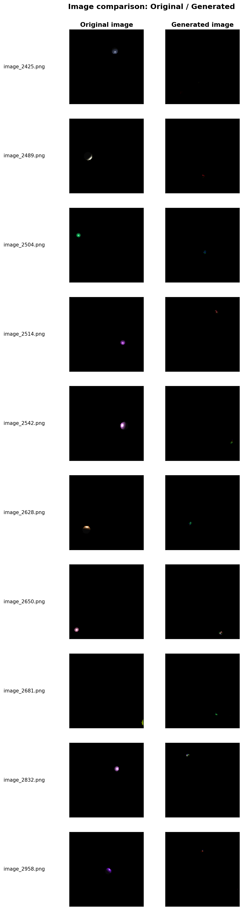
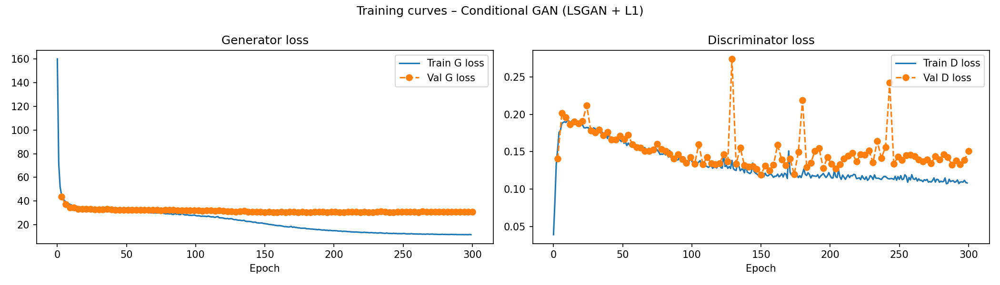

# SIGK - Projekt 3: Rendering

## Opis projektu


Celem projektu było stworzenie modelu sztucznej inteligencji, który realizuje model oświetlenia Phonga dla zadanej sceny 3D. Model na wejściu przyjmuje wektor parametrów sceny (pozycja obiektu, kolor rozproszenia, współczynnik połyskliwości, pozycja światła) i generuje odpowiadający obraz 128×128 px.

---

## Przygotowanie zbioru danych
Autor: Dominika Boguszewska

W ramach przygotowania zbioru danych zmodyfikowałam funkcję `on_render` w klasie `PhongWindow`, dodając losowanie parametrów sceny przy każdym renderze. Dla każdego z 3000 obrazów losowane były: pozycja kuli i źródła światła (każda składowa z zakresu (-20, 20)), kolor rozproszenia materiału (każda składowa z (0, 255), normalizowana do (0, 1) dla shadera) oraz współczynnik połyskliwości z zakresu (3, 20). Pozostałe parametry, czyli kolor otoczenia, odbicia oraz kolory światła były stałe.

Każdy wygenerowany obraz (128×128 px) był zapisywany do katalogu `images/` jako `image_XXXX.png`, a towarzyszący mu plik JSON z użytymi parametrami do katalogu `params/` jako `XXXX.json`. 

Dodatkowo dodałam zabezpieczenie odrzucające prawie czarne obrazy, czyli przypadki gdy kula wylądowała poza kadrem kamery.

## Model dyfuzyjny
Autor: Dominika Boguszewska

### Podział danych

| Zbiór       | Indeksy       | Liczba próbek |
|-------------|---------------|---------------|
| Treningowy  | 0 – 2039      | 2040          |
| Walidacyjny | 2040 – 2399   | 360           |
| Testowy     | 2400 – 2999   | 600           |

---

### Architektura modelu

Model stanowi wariant architektury U-Net, rozszerzony o mechanizmy warunkowania oraz embedding czasu, charakterystyczne dla modeli dyfuzyjnych, takich jak DDPM. Jego celem jest przetwarzanie obrazu wejściowego z uwzględnieniem kroku czasowego procesu oraz dodatkowych parametrów warunkujących.

Model składa się z elementów takich jak:
- **Sinusoidalny embedding czasu** - przekształca skalar reprezentujący krok czasowy t do wektora o ustalonym wymiarze, który koduje informację o pozycji w procesie dyfuzyjnym przy użyciu funkcji sinus i cosinus o różnych częstotliwościach,
- **Embedding warunku** - przyjmuje dodatkowe dane wejściowe w postaci wektora parametrów, które są mapowane do przestrzeni o tym samym wymiarze co embedding czasu,
- **Blok resztkowy (Residual Block)** - podstawowy element architektury składający się z warstw kowolucyjnych, GroupNorm oraz funkcji aktywacji SiLU,
- **Mechanizm Self-Attention** - umożliwiający modelowanie zależności globalnych pomiędzy wszystkimi pikselami obrazu.

---

### Model dyfuzyjny (DDPM)

Zastosowano model dyfuzyjny typu DDPM, którego celem jest stopniowe generowanie danych poprzez odwracanie procesu dodawania szumu.

Model składa się z dwóch głównych procesów:
- procesu forward (dyfuzji) – stopniowego dodawania szumu do danych,
- procesu reverse (denoisingu) – iteracyjnego usuwania szumu przy użyciu sieci neuronowej (U-Net).

W celu ewaluacji zaimplementowano również wariant deterministyczny, inspirowany metodą DDIM (Denoising Diffusion Implicit Models), który umożliwia znaczące przyspieszenie generacji. Zamiast pełnej liczby kroków T, używana jest mniejsza liczba kroków K≪T.

Zarówno w procesie DDPM, jak i DDIM, model przyjmuje dodatkowy wektor warunkujący cond, który wpływa na generowane próbki. Dzięki temu możliwe jest sterowanie wynikami generacji, np. poprzez parametry wejściowe.

---

### Trening

#### Środowisko

| Parametr       | Wartość         |
|----------------|-----------------|
| Platforma      | Kaggle Notebook |
| GPU            | NVIDIA Tesla T4 |
| Framework      | PyTorch (CUDA)  |
| Seed           | 42              |

#### Hiperparametry treningu

| Hiperparametr           | Wartość       |
|-------------------------|---------------|
| Liczba epok             | 200           |
| Batch size              | 32            |
| Learning Rate           | 1e-4          |
| Funkcja straty          | MSE Loss      |
| Optimizer               | Adam          |
| EMA Model               | AveragedModel |
| Scheduler               | OneCycleLR    |
| Early stopping patience | 10            |

#### Przebieg treningu

Proces treningu realizowany jest w pętli epok, z wykorzystaniem optymalizatora Adam oraz harmonogramu zmiany współczynnika uczenia OneCycleLR. Dodatkowo zastosowano mechanizm uśredniania wag modelu (EMA – Exponential Moving Average), który poprawia stabilność i jakość generowanych próbek.

Na końcu każdej epoki aktualna wartości funckji straty na zbiorze walidacyjnym była porównywana z najlepszą uzyskaną stratą walidacyjną. Jeśli uległa ona poprawie, model EMA był zapisywany jako najlepszy (`best_model.pth`). W przeciwnym przypadku zwiększany był licznik braku poprawy. Po przekroczeniu ustalonego progu (`EARLY_STOPPING_PATIENCE`) trening był przerywany (early stopping).

Trening zakończył się po 67 epokach ze stratą treningową 0.0018 oraz walidacyjną 0.00088. Natomiast w pliku `best_model.pth` był zapisany model z 57 epoki ze stratą treningową 0.0012 oraz walidacyjną 0.00077.

---

### Ewaluacja

#### Metryki jakości

| Metoda          | FLIP   | LPIPS  | SSIM   | Hausdorff |
|-----------------|--------|--------|--------|-----------|
| Model dyfuzyjny | 0.0211 | 0.7940 | 0.0020 | 74.9360   |

#### Interpretacja metryk

- **FLIP (0.0211):** Niska wartość metryki FLIP wskazuje na niewielkie różnice percepcyjne między obrazami generowanymi a referencyjnymi. Oznacza to, że z punktu widzenia ludzkiego wzroku lokalne błędy są stosunkowo małe. Model dobrze odwzorowuje ogólną percepcję obrazu, mimo możliwych różnic strukturalnych.
- **LPIPS (0.7940):** Wysoka wartość LPIPS sugeruje dużą różnicę percepcyjną na poziomie cech wysokiego poziomu (deep features). Oznacza to, że choć obrazy mogą wyglądać podobnie globalnie, model nie odwzorowuje dobrze bardziej złożonych struktur i semantyki obrazu. Wskazuje to na ograniczoną zdolność modelu do uchwycenia szczegółowych cech wizualnych.
- **SSIM (0.0020):** Bardzo niska wartość SSIM oznacza niemal całkowity brak zgodności strukturalnej między obrazami. Model nie zachowuje lokalnych zależności przestrzennych, takich jak krawędzie czy tekstury. Może to sugerować, że generowane obrazy są znacznie zdeformowane względem oryginałów lub różnią się w układzie przestrzennym.
- **Hausdorff (74.9360 px):** Wysoka wartość odległości Hausdorffa wskazuje na duże maksymalne odchylenia między odpowiadającymi sobie strukturami w obrazach. Oznacza to, że w najgorszych przypadkach elementy obrazu są znacząco przesunięte lub niepokrywające się, co potwierdza problemy z dokładnym odwzorowaniem geometrii.

#### Porównanie wygenerowanych obrazów z oryginalnymi

Modelem `diffusion_model_results/2026-04-27_18-16-28/best_model.pth` wygenerowano 600 obrazów dla wszystkich próbek zbioru testowego.



---

### Podsumowanie

Uzyskane rezultaty wskazują, że model generuje obrazy o niskiej jakości i ograniczonej zgodności z danymi referencyjnymi. Pomimo zastosowania architektury dyfuzyjnej, model nie nauczył się poprawnie odwzorowywać struktury generowanych obiektów.

W praktyce wygenerowane obrazy często przyjmują formę nieregularnych skupisk kolorowych pikseli na czarnym tle, zamiast oczekiwanych, spójnych wizualnie obiektów. W szczególności model nie odtwarza poprawnie:
- kształtu obiektu (np. kuli),
- ciągłości powierzchni,
- efektów oświetlenia, takich jak model odbicia Phonga.

Wyniki te są spójne z uzyskanymi metrykami jakości:
- bardzo niska wartość SSIM wskazuje na brak zgodności strukturalnej,
- wysoka odległość Hausdorffa potwierdza duże błędy geometryczne,
- wysoki LPIPS sugeruje brak zgodności na poziomie cech percepcyjnych.

Można zatem wnioskować, że model nie nauczył się reprezentacji przestrzennej ani fizycznych właściwości sceny, a jego predykcje mają w dużej mierze charakter losowy lub silnie zaszumiony.

Podsumowując, obecna konfiguracja modelu oraz proces treningowy nie pozwalają na generowanie realistycznych obrazów zgodnych z założeniami zadania.

---

## Sieć GAN
Autor: Filip Langiewicz

### Podział danych

| Zbiór      | Indeksy       | Liczba próbek |
|------------|---------------|---------------|
| Treningowy | 0 – 2399      | 2 400         |
| Testowy    | 2400 – 2999   | 600           |

### Normalizacja parametrów

Parametry sceny są normalizowane do zakresu `[−1, 1]`:

| Parametr wejściowy        | Transformacja                                          | Wymiar |
|---------------------------|--------------------------------------------------------|--------|
| Pozycja obiektu (x, y, z) | `t / TRANS_SCALE`                                      | 3      |
| Kolor rozproszenia (r,g,b)| `v * 2.0 − 1.0`                                        | 3      |
| Połyskliwość              | `((s − SHINE_MIN) / (SHINE_MAX − SHINE_MIN)) * 2 − 1` | 1      |
| Pozycja światła (rel.)    | `(light_pos − model_pos) / (2 * LIGHT_SCALE)`         | 3      |

> **Uwaga:** pozycja światła jest kodowana **relatywnie** względem pozycji obiektu, co ułatwia modelowi generalizację.

Wektor warunkujący ma wymiar **10** (`cond_dim = 10`).

---

### Architektura modeli

### Generator

Generator warunkowy buduje obraz od zera, startując od małej reprezentacji
i stopniowo zwiększając rozdzielczość. Na wejściu otrzymuje dwa wektory:
wektor szumu `z` (wymiar 8) wprowadzający losowość oraz wektor parametrów
sceny `c` (wymiar 10). Po konkatenacji powstaje wektor 18-wymiarowy.

Następnie sieć pięciokrotnie podwaja rozdzielczość za pomocą transpozycji
konwolucyjnych (ConvTranspose2d, stride=2), aż do osiągnięcia docelowych
128×128 px. Każdy blok upsamplingu zawiera BatchNorm i aktywację ReLU,
poza ostatnim, który stosuje Tanh (wyjście w zakresie `[−1, 1]`).

| Parametr          | Wartość       |
|-------------------|---------------|
| `noise_dim`       | 8             |
| `cond_dim`        | 10            |
| `features_g`      | 64            |
| Liczba parametrów | **7 107 459** |

Wagi inicjalizowane są metodą DCGAN: warstwy konwolucyjne z rozkładu
`N(0, 0.02)`, BatchNorm z `N(1, 0.02)` z biasem zerowym.

---

### Dyskryminator

Dyskryminator warunkowy ocenia, czy dany obraz jest prawdziwy, biorąc pod
uwagę kontekst sceny (`c`). Obraz i wektor warunkujący przetwarzane są
**oddzielnymi gałęziami**, których wyjścia łączone są dopiero w końcowej
głowicy klasyfikatora.

**Gałąź obrazu** redukuje przestrzennie wejście `3 × 128 × 128` przez
cztery warstwy konwolucyjne ze stride=2, uzyskując tensor `128 × 8 × 8`,
który spłaszczany jest do wektora o długości 8 192. Każda warstwa stosuje
LeakyReLU(0.2) oraz **spectral normalization**, która stabilizuje trening
ograniczając stałą Lipschitza dyskryminatora.

**Gałąź warunkowa** rzutuje wektor `c` (dim=10) na przestrzeń 128 za
pomocą jednej warstwy liniowej ze spectral normalization i LeakyReLU.

Oba wektory są konkatenowane (łączny wymiar: 8 320) i przekazywane do
głowicy, która przez dwie warstwy liniowe (z Dropout(0.3)) produkuje
jeden logit klasyfikacji.


| Parametr          | Wartość       |
|-------------------|---------------|
| `cond_dim`        | 10            |
| `features_d`      | 16            |
| Liczba parametrów | **8 695 937** |

---
### Funkcja straty

Projekt używa wariantu **LSGAN** (Least Squares GAN) z dodatkową stratą rekonstrukcyjną L1 ważoną maską pierwszoplanową.

### Strata dyskryminatora

Strata dyskryminatora (LSGAN) jest średnią z dwóch składników MSE:

| Składnik        | Wejście do D         | Etykieta docelowa | Waga |
|-----------------|----------------------|-------------------|------|
| Próbki prawdziwe | `D(x_real, c)`      | **0.9** (smoothing) | 0.5 |
| Próbki fałszywe | `D(x_fake, c)`      | **0.0**             | 0.5 |

```python
L_D = 0.5 * (MSE(D(x_real, c), 0.9) + MSE(D(x_fake, c), 0.0))
```

Wartość docelowa dla próbek prawdziwych wynosi **0.9** (label smoothing).

### Strata generatora

Generator minimalizuje sumę dwóch składników: straty adversarialnej
(chce „oszukać" dyskryminator) oraz ważonej straty rekonstrukcyjnej L1:

| Składnik | Opis | Waga |
|---|---|---|
| `L_adv` | `MSE(D(x_fake, c), 1.0)` – generator chce, by D uznał obraz za prawdziwy | 1.0 |
| `L_L1` | Masked L1 między obrazem wygenerowanym a referencyjnym | `λ_L1 = 200.0` |

``` python
L_G = L_adv + λ_L1 · L_masked_L1
= MSE(D(x_fake, c), 1.0) + 200.0 · L_masked_L1
```


### Ważona strata L1 (Masked L1)

Standardowa strata L1 traktuje wszystkie piksele równo, co przy czarnym tle
jest problematyczne – sieć mogłaby zignorować kulę i „zaoszczędzić" stratę
na tle (co też miało miesjce - sieć wpadała w takie lokalne minimum). Rozwiązaniem jest maska pierwszoplanowa wyznaczana na podstawie
jasności pikseli obrazu referencyjnego:

```python
mask = (real_01.abs().mean(dim=1, keepdim=True) > 0.05).float()
weights = 1.0 + (fg_weight - 1.0) * mask   # fg_weight = 50.0
L_masked_L1 = (weights * |x_fake - x_real|).mean()
```

Piksele jaśniejsze niż próg 0.05 (kula, oświetlenie) otrzymują wagę **50×**
większą niż tło. Dzięki temu model skupia się na poprawnym odwzorowaniu
kształtu i oświetlenia kuli, a nie na minimalizowaniu błędu na czarnym tle.

---

### Proces treningu

### Środowisko

| Parametr       | Wartość                    |
|----------------|----------------------------|
| Platforma      | Kaggle Notebook            |
| GPU            | **NVIDIA Tesla T4**        |
| Framework      | PyTorch (CUDA)             |
| Czas treningu  | ~58.7 min (3 520 s)        |
| Seed           | 42                         |

### Hiperparametry treningu

| Hiperparametr       | Wartość              |
|---------------------|----------------------|
| Liczba epok         | **300**              |
| Batch size          | **64**               |
| `lr_G`              | **2e-4**             |
| `lr_D`              | **3e-5**             |
| Betas (Adam)        | (0.5, 0.999)         |
| `lambda_l1`         | **200.0**            |
| `save_every`        | **3**       |
| Scheduler (G i D)   | CosineAnnealingLR, `T_max=300`, `eta_min=1e-5` |
| `num_workers`       | 0                    |
| `pin_memory`        | True (CUDA)          |

### Pętla treningowa

W każdej iteracji:

1. **Trening dyskryminatora:**
   - Generacja `fake_imgs = G(z, c)` z `torch.no_grad()`
   - Obliczenie `L_D` na podstawie `D(real, c)` i `D(fake, c)`
   - Krok optymalizatora dla D

2. **Trening generatora:**
   - Nowe losowanie `z`, generacja `fake_imgs = G(z, c)`
   - Obliczenie `L_G = L_adv + λ_L1 * L_masked_L1`
   - Krok optymalizatora dla G

3. Po każdej epoce: krok schedulera LR (`sched_G.step()`, `sched_D.step()`).

### Wybór najlepszego modelu

Co `save_every=3` epoki obliczana jest walidacyjna strata generatora. Checkpoint `G_best.pth` / `D_best.pth` zapisywany jest za każdym razem, gdy `val_G < best_val_G`.

**Najlepsza walidacyjna strata generatora: 30.7383** (epoka 240).

### Przebieg treningu



Strata treningowa generatora systematycznie spada przez cały trening (155.9 → 11.9),
co jest głównie zasługą poprawy składnika L1 (0.776 → 0.057). Strata adversarialna
stabilizuje się w przedziale 0.50–0.57 po ok. 100 epokach, co świadczy o utrzymaniu
równowagi między generatorem a dyskryminatorem.

Mimo nieuzyskania poprawy wartośći funkcji straty na zbiorze testowym po około 100 epokach, zdecydowano się skorzystać z modelu końcowego (z 300 epoki). Decyzja została podjęta na podstawie oceny wizualnej wyników, jakie uzyskiwały sieci w poszczególnych checkpointach.

---

### Ewaluacja

### Generacja obrazów testowych

Modelem `G_best.pth` wygenerowano 600 obrazów dla wszystkich próbek zbioru testowego. Wektor szumu ustawiony na **zero** (`z = 0`) w trybie ewaluacji - gwarantuje deterministyczne wyjście.


### Metryki jakości

Obliczenia wykonano przy użyciu bibliotek: `flip_evaluator`, `lpips` (AlexNet v0.1), `skimage.metrics.structural_similarity`, `scipy.spatial.distance.directed_hausdorff` (krawędzie Canny z OpenCV).

| Metoda            | FLIP↓   | LPIPS↓  | SSIM↑   | Hausdorff↓ |
|-------------------|---------|---------|---------|------------|
| neural_renderer_gan   | **0.0125** | **0.1303** | **0.9650** | **19.63** |

### Interpretacja metryk

- **FLIP (0.0125):** Bardzo niska wartość (~1.25% mapy błędów) – błędy percepcyjne są minimalne. FLIP dobrze wykrywa lokalne różnice kolorystyczne i krawędziowe widoczne dla ludzkiego oka.
- **LPIPS (0.1303):** Umiarkowana wartość dystansu percepcyjnego (AlexNet). Sieć poprawnie odwzorowuje strukturę oświetlenia, lecz pewne subtelne różnice w rozbłyskach są jeszcze widoczne.
- **SSIM (0.9650):** Wysoka wartość podobieństwa strukturalnego – model odtwarza kształt, jasność i kontrast kuli.
- **Hausdorff (19.63 px):** Odległość Hausdorffa liczona na obrazach krawędziowych (Canny). Wartość 19.63 px wskazuje, że w nielicznych przypadkach krawędzie kuli lub rozbłysków mogą być lekko przesunięte (szczególnie przy ekstremalnych pozycjach obiektu).

> **Wnioski dot. metryk:** SSIM i FLIP dobrze oddają ogólną jakość obrazu. LPIPS jest bardziej czuły na różnice teksturalne (rozbłyski). Hausdorff może być zawyżony przez krawędzie szumowe lub drobne przesunięcia kuli – niekoniecznie odzwierciedla subiektywną jakość renderingu.


### Podsumowanie

Model osiągnął bardzo dobre wyniki jakościowe (SSIM=0.965, FLIP=0.0125), skutecznie aproksymując model oświetlenia Phonga dla scen z jedną kulą i punktowym źródłem światła. Mimo dobrych wyników metryk widać, że wygenerowanym obiektom brakuje czasem jedności strukturalnej i odpowiedniego położenia. Może to świadczyć o tym, że oceniane obiekty stanowią zbyt małą część sceny i sieć nie jest w stanie optymalnie wyjść z lokalnego minimum - generowania czarnego tła.
